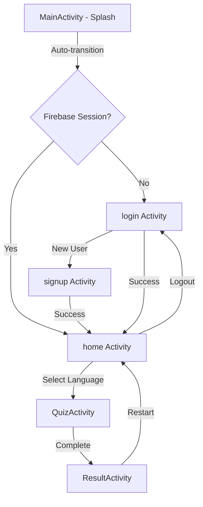

# Quiz App - Android Application

A comprehensive Android Quiz Application built with Java, featuring a clean UI, custom animations, and Firebase integration.

## 🚀 Working Roadmap

### Phase 1: Foundation & Auth
- [x] Project Initialization and Android Architecture Setup.
- [x] Firebase Project Integration (Authentication & Firestore).
- [x] Implementation of `MainActivity` as an animated Splash Screen.
- [x] Secure Login and Signup systems with real-time validation.

### Phase 2: Core UI & Navigation
- [x] Design the `home` dashboard with category-based language selection.
- [x] Implement Search functionality for quiz categories.
- [x] Develop custom button click and layout entry animations.

### Phase 3: Quiz Engine
- [x] Create the `QuizActivity` with dynamic question loading.
- [x] Implementation of score tracking and progress indicator.
- [x] Question banks for Java, Python, Kotlin, C++, C, and JavaScript.

### Phase 4: Results & Polish
- [x] `ResultActivity` to summarize performance and calculated scores.
- [x] UI/UX enhancements and Edge-to-Edge display support.
- [ ] Multi-level difficulty implementation (Future).
- [ ] Global Leaderboard (Future).

## 📊 App Flow Diagram

## 🛠 Tech Stack
- **Language:** Java (Android SDK)
- **Backend:** Firebase Authentication, Cloud Firestore
- **UI:** XML Layouts, Material Design 3
- **Animations:** Custom XML-based Android Animations
- **Architecture:** Standard Activity-based architecture with clean separation of concerns.

## 📁 Key Files
- `MainActivity`: Animated entry point with session handling.
- `login` / `signup`: User authentication modules.
- `home`: Central hub for category selection.
- `QuizActivity`: Dynamic quiz logic and state management.
- `ResultActivity`: Performance summary and feedback.
